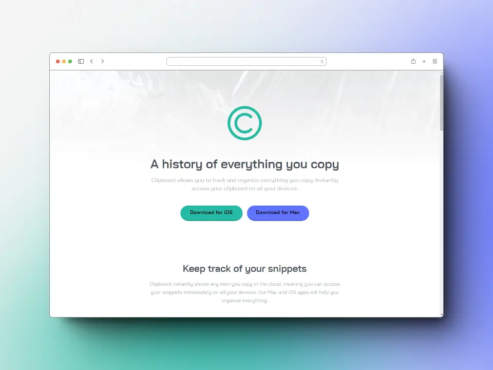

# Frontend Mentor - Clipboard landing page solution

This is a solution to the [Clipboard landing page challenge on Frontend Mentor](https://www.frontendmentor.io/challenges/clipboard-landing-page-5cc9bccd6c4c91111378ecb9).

Frontend Mentor challenges help you improve your coding skills by building realistic projects.

## Table of contents

- [The challenge](#the-challenge)
- [Screenshot](#screenshot)
- [Links](#links)
- [Built with](#built-with)
- [Author](#author)

## *The challenge*

Users should be able to:

🎯 View the optimal layout for the site depending on their device's screen size

🎯 See hover states for all interactive elements on the page

## *Screenshot*

### 📱 Mobile

### 💻 Desktop

## *Links*

[Live site](https://mendez-v.github.io/clipboard-landing/) 👀

[My Solution in FM](https://www.frontendmentor.io/solutions/clipboard-landing-page-using-where-e0h1fvzUIj) 👀

[Repo all my FM challenges](https://github.com/mendez-v/frontend-mentor-challenges) 👀

## *Built with*

📌 Semantic HTML5 markup

📌 CSS custom properties

📌 Utility classes

📌 Flexbox

📌 CSS Grid

📌 Mobile-first workflow

## *Author*

- Frontend Mentor - [@mendez-v](https://www.frontendmentor.io/profile/mendez-v)
